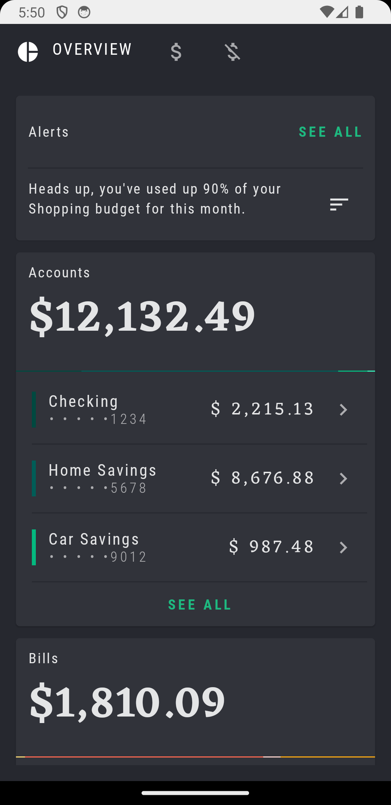
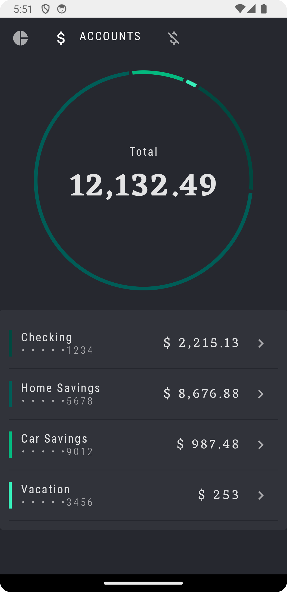
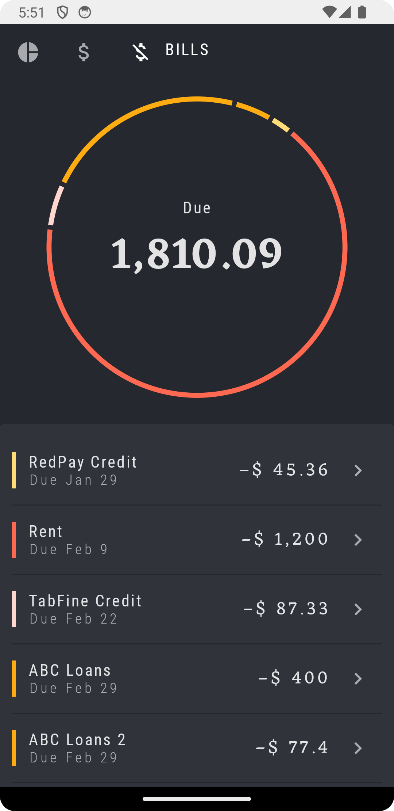

# Olley

🚀 **Olley Bank Simulator** is a mobile application that allows users to view their account balance
and track their transaction history.

## Features

- 📊 **View Account Overview**: Easily view of your current accounts and balances.
- 📜 **Transaction History**: View a list of all transactions including deposits, withdrawals, and
  transfers.
- 🔔 **Alerts**: List of alerts.

## Screenshots

    
    
    

## Demo Video

Check out this video to see the app in action:

## Getting Started

Follow these instructions to get a copy of the project up and running on your local machine for
development and testing purposes.

### Prerequisites

- [Android Studio](https://developer.android.com/studio)
- Java JDK 11 or higher
- Android SDK

### Built With
- Kotlin
- Jetpack Compose
- Material Design

